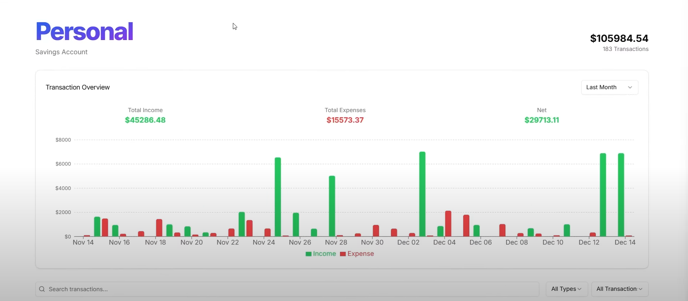
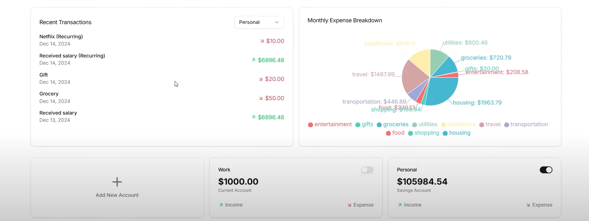

# FinSightAI – Finance Tracker

**FinSightAI** is an advanced financial analytics tool designed to assist portfolio managers, investors, and finance enthusiasts in making informed investment decisions. By leveraging AI technologies, FinSightAI provides deep insights and actionable summaries about companies, aiding users in understanding financial metrics and market sentiment.

---






##  Features

* **Company Overview**: Provides a concise summary of the company's business model, market position, and key highlights.

* **Income Statement Analysis**: Delivers insights into the company's revenue streams, cost structures, and profitability metrics.

* **Balance Sheet Overview**: Offers a snapshot of the company's assets, liabilities, and shareholders' equity.

* **Cash Flow Analysis**: Breaks down the company's cash inflows and outflows from operating, investing, and financing activities.

* **News Sentiment Analysis**: Aggregates and analyzes recent news articles to gauge public sentiment towards the company.

* **AI-Powered Insights**: Utilizes machine learning algorithms to provide predictive analytics and trend forecasting.

---

## 🛠️ Technologies Used

* **Frontend**: React, Tailwind CSS

* **Backend**: Node.js, Express

* **Database**: MongoDB

* **AI & ML**: Python, scikit-learn, TensorFlow

* **APIs**: Alpha Vantage, News API

---

## 📦 Installation

### Prerequisites

* Node.js (v14 or higher)

* Python (v3.8 or higher)

* MongoDB (local or cloud instance)

### Steps

1. **Clone the repository**:

   ```bash
   git clone https://github.com/Pavan2589/FinSightAI---Finance-Tracker.git
   cd FinSightAI---Finance-Tracker
   ```

2. **Install frontend dependencies**:

   ```bash
   cd client
   npm install
   ```

3. **Install backend dependencies**:

   ```bash
   cd ../server
   npm install
   ```

4. **Set up environment variables**:

   Create a `.env` file in both `client` and `server` directories and add your API keys and database URIs.

5. **Run the application**:

   ```bash
   DATABASE_URL=
   DIRECT_URL=
   NEXT_PUBLIC_CLERK_PUBLISHABLE_KEY=
   CLERK_SECRET_KEY=
   NEXT_PUBLIC_CLERK_SIGN_IN_URL=/sign-in
   NEXT_PUBLIC_CLERK_SIGN_UP_URL=/sign-up
   NEXT_PUBLIC_CLERK_AFTER_SIGN_IN_URL=/onboarding
   NEXT_PUBLIC_CLERK_AFTER_SIGN_UP_URL=/onboarding
   GEMINI_API_KEY=
   RESEND_API_KEY=
   ARCJET_KEY=

```
